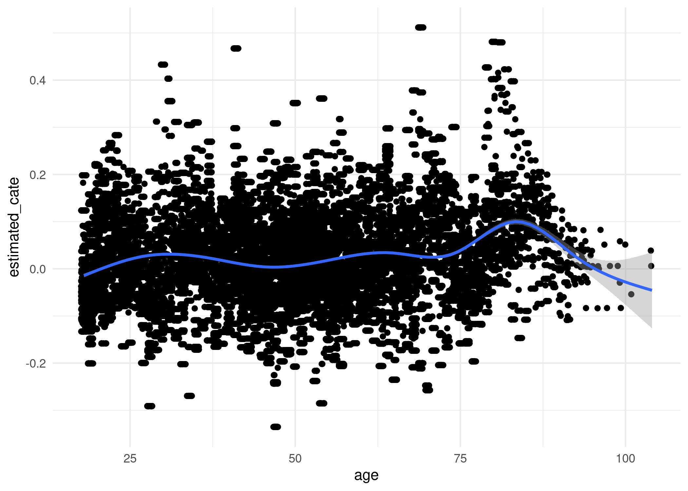

Voter Turnout
================
2022-12-12

``` r
library(causalToolbox)
library(data.table)
library(magrittr)
library(ggplot2)
```

``` r
# can't not...
theme_set(theme_minimal())
knitr::opts_chunk$set(dpi=300)
```

``` r
d_individual <- fread('http://hdl.handle.net/10079/d3669799-4537-411e-b175-d9e837324c35')
d_household  <- fread('http://hdl.handle.net/10079/sxksn6q')
```

``` r
d_individual <- d_individual[sample(1:.N, size=100000)]
```

``` r
d_individual[ , voted_numeric     := (voted == 'Yes') * 1]
d_individual[ , treatment_numeric := (treatment == ' Civic Duty') * 1]
```

# Look at Civic Duty Effect

The main result reported in the paper is the effect of civic duty. Begin
by replicating this effect on the current data.

``` r
SUBSET <- c(' Civic Duty', ' Control')

d_individual[treatment %in% SUBSET][
  , .(mean_vote = mean(voted == 'Yes'), 
      sem       = sqrt( (var(voted == 'Yes')) / .N)), by = .(treatment)]
```

    ##      treatment mean_vote         sem
    ## 1:     Control 0.2946787 0.001930403
    ## 2:  Civic Duty 0.3123752 0.004414724

``` r
d_individual[treatment %in% SUBSET][ 
  , t.test(voted == 'Yes' ~ treatment)]
```

    ## 
    ##  Welch Two Sample t-test
    ## 
    ## data:  voted == "Yes" by treatment
    ## t = 3.6728, df = 15526, p-value = 0.0002408
    ## alternative hypothesis: true difference in means between group  Civic Duty and group  Control is not equal to 0
    ## 95 percent confidence interval:
    ##  0.008252057 0.027141012
    ## sample estimates:
    ## mean in group  Civic Duty    mean in group  Control 
    ##                 0.3123752                 0.2946787

So, yes, we’re seeing the same effect as was reported.

# Causal Toolbox

``` r
model_1 <- X_RF(
  feat = d_individual[treatment %in% SUBSET, .(factor(sex), yob, hh_size, g2004_mean)],
  tr   = d_individual[treatment %in% SUBSET, treatment_numeric], 
  yobs = d_individual[treatment %in% SUBSET, voted_numeric]
)
```

``` r
est_cate_1 <- EstimateCate(
  theObject = model_1, 
  feature_new = d_individual[treatment %in% SUBSET, .(factor(sex), yob, hh_size, g2004_mean)]
  )
```

``` r
d_individual[treatment %in% SUBSET, estimated_cate := est_cate_1]
```

``` r
d_individual[treatment %in% SUBSET, .(means = mean(voted_numeric)), keyby = .(treatment)][,-1*diff(means)]
```

    ## [1] 0.01769653

``` r
d_individual[treatment %in% SUBSET, mean(estimated_cate)]
```

    ## [1] 0.01795698

``` r
d_individual[treatment %in% SUBSET, age := (2004 - yob)] %>% 
  ggplot() + 
  aes(x=age, y=estimated_cate) + 
  geom_jitter() + 
  stat_smooth()
```

    ## `geom_smooth()` using method = 'gam' and formula 'y ~ s(x, bs = "cs")'

    ## Warning: Removed 33202 rows containing non-finite values (stat_smooth).

    ## Warning: Removed 33202 rows containing missing values (geom_point).

<!-- -->
